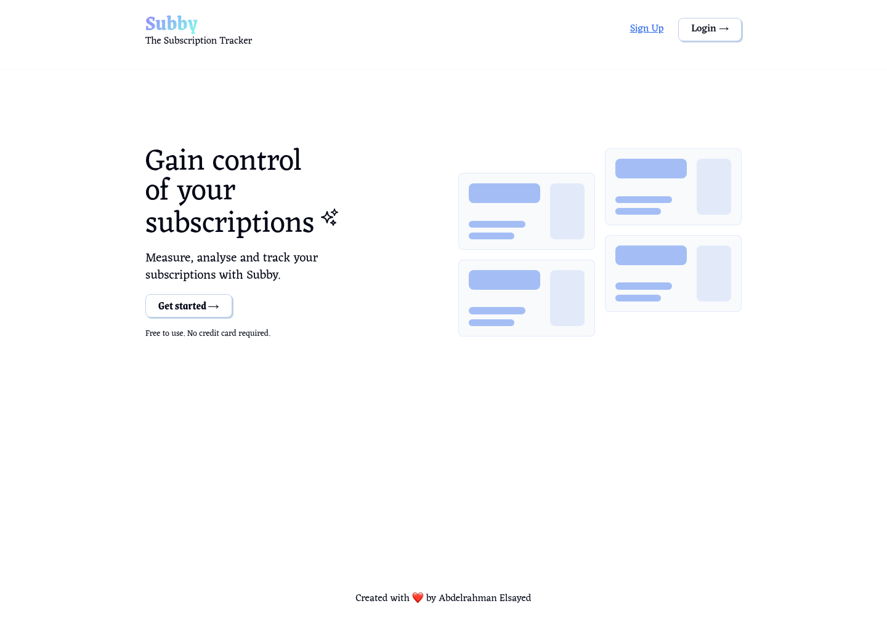

# Subby

A subscription tracker that helps you manage and track all your subscriptions in one place.

**Try it live:** [subbyyyyy.vercel.app](https://subbyyyyy.vercel.app/)

## Overview

Built with Next.js, React, and Firebase. Sign up, add your subscriptions, and track your spending. See exactly how much you're paying each month and manage all your active subscriptions.



## What You Get

- **Sign Up & Login** - Create an account with email and password
- **Add Subscriptions** - Track Netflix, Spotify, AWS, or any service you pay for
- **Set Details** - Add name, cost, billing frequency, category, and start date
- **Manage Subscriptions** - Edit or delete subscriptions anytime
- **Track Spending** - See your total monthly cost at a glance
- **Organize by Category** - Sort subscriptions by Entertainment, Music, Software, and more
- **Responsive Design** - Works perfectly on phone, tablet, and desktop
- **Real-time Sync** - All your data saves to Firebase instantly

## Tech Stack

**Frontend:**

- Next.js 16.2.1 - React framework
- React 19.2.4 - UI library
- CSS - Custom styling

**Backend & Database:**

- Firebase 12.11.0 - Authentication and database

## Project Structure

```
subby/
├── app/                              # Next.js app directory
│   ├── layout.js                     # Root layout with header and footer
│   ├── page.js                       # Home page
│   ├── dashboard/
│   │   └── page.js                   # Dashboard page (main app)
│   ├── globals.css                   # Global styles
│   ├── fanta.css                     # Additional styles
│   └── Head.js                       # HTML head metadata
├── components/                       # Reusable React components
│   ├── Dashboard.jsx                 # Main dashboard container
│   ├── SubscriptionForm.jsx          # Form to add/edit subscriptions
│   ├── SubscriptionsDisplay.jsx      # List of subscriptions with cards
│   ├── SubscriptionSummary.jsx       # Summary of total spending
│   ├── ExpenseCard.jsx               # Individual subscription card
│   ├── Hero.jsx                      # Landing page hero section
│   ├── Login.jsx                     # Login and signup form
│   └── GoTo.jsx                      # Navigation component
├── context/                          # React Context for state management
│   └── AuthContext.jsx               # Authentication logic and user subscriptions
├── utils/                            # Utility functions and constants
│   └── index.js                      # Helper functions
├── firebase.js                       # Firebase configuration
├── next.config.mjs                   # Next.js configuration
├── jsconfig.json                     # JavaScript configuration
├── eslint.config.mjs                 # ESLint configuration
└── package.json                      # Dependencies and scripts
```

## Getting Started

### What You Need

- Node.js 18+ (LTS recommended)
- npm or yarn
- Firebase project account

### Installation Steps

1. **Clone the repository**

   ```bash
   git clone https://github.com/thehappyredwolf/subby.git
   cd subby
   ```

2. **Install dependencies**

   ```bash
   npm install
   ```

3. **Set up Firebase**

   Create a `.env.local` file in the root directory with your Firebase credentials:

   ```env
   NEXT_PUBLIC_FIREBASE_APIKEY=your_api_key
   NEXT_PUBLIC_FIREBASE_AUTHDOMAIN=your_auth_domain
   NEXT_PUBLIC_FIREBASE_PROJECTID=your_project_id
   NEXT_PUBLIC_FIREBASE_STORAGEBUCKET=your_storage_bucket
   NEXT_PUBLIC_FIREBASE_MESSAGINGSENDERID=your_messaging_sender_id
   NEXT_PUBLIC_FIREBASE_APPID=your_app_id
   ```

4. **Start the development server**

   ```bash
   npm run dev
   ```

   Open [http://localhost:3000](http://localhost:3000) in your browser

## Available Commands

- `npm run dev` - Start the development server
- `npm run build` - Create a production build
- `npm start` - Run the production build
- `npm run lint` - Check code for errors

## How It Works

### User Journey

1. **Visit the homepage** - See what Subby can do
2. **Sign up or log in** - Create an account or use existing one
3. **Go to dashboard** - This is where you manage everything
4. **Add a subscription** - Fill in the form with subscription details
5. **See all subscriptions** - View all your subscriptions as cards
6. **Check your spending** - See total cost and breakdown by category
7. **Edit or delete** - Update subscriptions or remove them anytime

### Data Storage

Your subscriptions are stored in Firebase Firestore with this structure:

```javascript
users/{uid}
  → subscriptions: [
      {
        name: "Netflix",
        cost: 15.99,
        currency: "USD",
        category: "Entertainment",
        billingFrequency: "Monthly",
        startDate: "2024-01-15",
        status: "Active",
        notes: "Standard plan"
      }
    ]
```

### Key Features

- **Authentication** - Secure login with Firebase Auth
- **Add Subscriptions** - Simple form to add new subscriptions
- **Edit Mode** - Update subscription details
- **Delete** - Remove subscriptions you no longer need
- **Summary** - See total spending and status
- **Categories** - Organize by type (Entertainment, Music, Software, etc.)

## Environment Variables

Create a `.env.local` file with these Firebase variables:

| Variable                                 | Description             |
| ---------------------------------------- | ----------------------- |
| `NEXT_PUBLIC_FIREBASE_APIKEY`            | Firebase API Key        |
| `NEXT_PUBLIC_FIREBASE_AUTHDOMAIN`        | Firebase Auth Domain    |
| `NEXT_PUBLIC_FIREBASE_PROJECTID`         | Firebase Project ID     |
| `NEXT_PUBLIC_FIREBASE_STORAGEBUCKET`     | Firebase Storage Bucket |
| `NEXT_PUBLIC_FIREBASE_MESSAGINGSENDERID` | Firebase Messaging ID   |
| `NEXT_PUBLIC_FIREBASE_APPID`             | Firebase App ID         |

## Future Ideas

- [ ] Monthly spending charts and graphs
- [ ] Budget alerts for high spending
- [ ] Export data to CSV
- [ ] Dark mode support
- [ ] Subscription reminders
- [ ] Shared family subscriptions
- [ ] Filter by category
- [ ] Search subscriptions

## Performance

- Fast page loads with Next.js
- Optimized CSS
- Real-time data with Firebase
- Mobile-first design

## License

[ISC License](LICENSE) - feel free to use this project however you want
